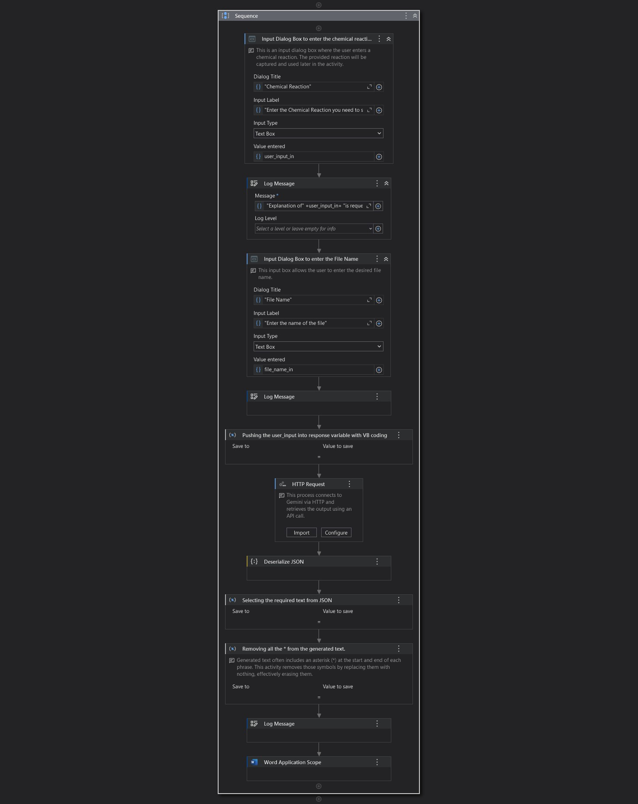
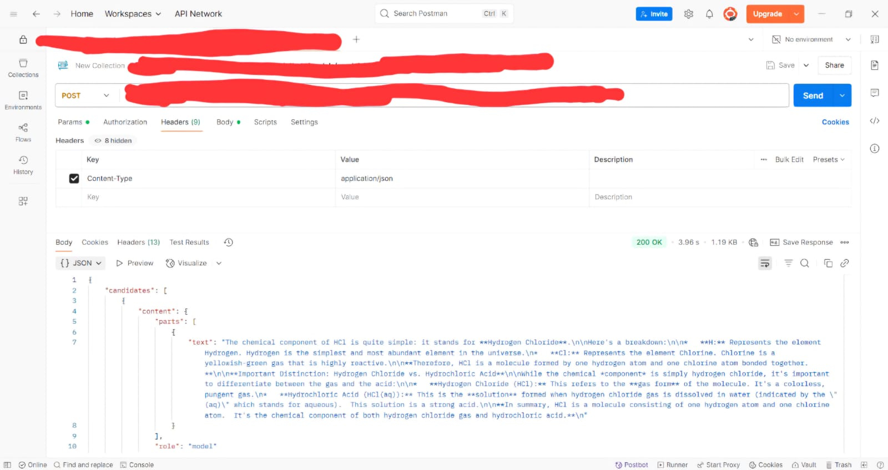
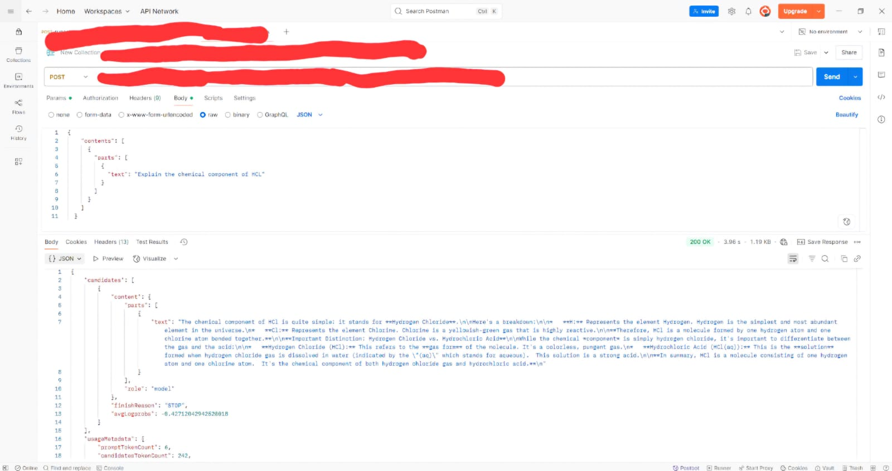

# 🌟 ChemWisper Bot

**ChemWisper Bot** is an intelligent UiPath automation that simplifies complex chemical terminology. It uses **Google Gemini AI** to generate clear, human-readable explanations from chemical names and stores the results in a structured Word document.

---

## 🔬 Description

ChemWisper Bot is a UiPath automation that uses Gemini AI to generate human-friendly explanations for chemical names and saves them in a Word document. It streamlines chemical understanding through intelligent automation and seamless API integration.

---

## 🧰 Tools & Technologies Used

- **UiPath Studio**: For building the RPA process and managing workflow logic.  
- **Google Gemini API**: Provides advanced natural language processing to explain chemical terms.  
- **Postman**: Used for designing, testing, and validating the Gemini API before integrating with UiPath.  
- **Microsoft Word Automation**: To create and update documents with AI-generated explanations.

---

## ⚙️ Features

- Accepts user input for chemical names.  
- Sends secure HTTP requests to the Gemini API with proper headers and payload.  
- Parses the AI-generated response using UiPath expressions.  
- Dynamically writes clean explanations into a Word document.  
- Includes error handling, logging, and annotations for better maintainability.

---

## 🚀 How It Works

[User Inputs Chemical Name] -> [UiPath Sends HTTP Request to Gemini API] -> [Gemini AI Returns Explanation] -> [UiPath Parses the Response] -> [Explanation is Written into Word Document]

---

## 📸 Images

- 
  *Screenshot of the UiPath workflow*

-   
  *Postman request*

-   
  *Postman request and response example*

---

## 📘 About the Tools

### ⚙️ UiPath  
UiPath is a top-tier Robotic Process Automation (RPA) platform. It allows automation of repetitive tasks by using visual workflows. In ChemWisper, UiPath manages the entire process — from taking user input to writing the AI response in a Word document — seamlessly and without manual work.

### 🤖 Google Gemini  
Gemini is Google’s state-of-the-art AI model designed for natural language tasks. It can analyze complex text and generate clear, concise, and informative responses. In this project, it converts chemical terms into simple explanations, making chemistry more accessible.

### 🧪 Postman  
Postman is an API testing tool used by developers to build, test, and optimize RESTful APIs. It played a critical role in this project by helping test the Gemini API’s request/response cycle before integrating it into UiPath, ensuring reliable data flow.

---

